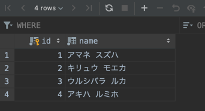
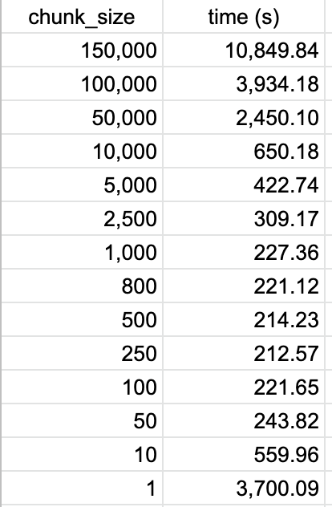

# Spring Batch
## Batch とは
>データ処理におけるバッチ処理（バッチしょり）は、ひとまとまりのデータを一括して処理する方式である。逐次生み出されるデータを一定期間・一定量集めたものをバッチといい、このバッチ単位で処理をおこなう方式がバッチ処理である。
>比較される方式として、逐次生み出されるデータをストリームとして捉え到着したデータを順次扱うストリーム処理がある。データをキューイングせず即時処理するリアルタイム処理とも比較される。
>(引用: Wikipedia)

### Batch のメリット
* 大量のデータを一括で処理することができる
* 処理を夜間などのシステム負荷の少ない時間帯に実施することができる
* サービスを停止していればデータの整合性を容易に保てる

など

### Batch のデメリット
* 即時性がない
* データが想定より多いと終わりきれない可能性がある
    * サーバーやネットワークの負荷、実行時間などを考慮する必要がある

など

## Spring Batch 概要
### Spring Batch とは
>エンタープライズシステムの日々の運用に不可欠な堅牢なバッチアプリケーションの開発を可能にするために設計された、軽量で包括的なバッチフレームワーク。
>Spring Batch は、ロギング / トレース、トランザクション管理、ジョブ処理統計、ジョブの再起動、スキップ、リソース管理など、大量のレコードの処理に不可欠な再利用可能な機能を提供します。
>(引用: Spring 公式)

### Job, Step と Step の処理方式
>Spring BatchはJobという単位でバッチ処理を行います。
>Jobは複数のStepを順番に実行します。
>Stepには入力、処理、出力をひとまとまりに実行するChankと自由に処理を実行できるTaskletというふたつの種類があります。
>(引用: https://tech-lab.sios.jp/archives/11402)


(引用: https://tech-lab.sios.jp/archives/11402)


## Spring Batch - Chunk を試してみる
### 内容
* `beforeUser.csv` のデータを読み取り、加工して DB の`after_user` テーブルに挿入
* 加工は、姓・名を分けて受け取っていたものを、繋げて name として DB に保存するということをしています(適当)

### 処理の流れ
* Job から Step が実行される
* chunk 単位でトランザクションを開始
* chunk サイズ(以下の場合は `10` )に達するまで `reader` , `processor` を繰り返す
    * `reader` : 入力データを取得
    * `processor` : 入力データに対する処理
* chunk サイズに達したら `writer` を実施
    * `writer` : chunk サイズ分のデータを出力 
* 正常に出力できたらコミット
* 例外が発生したらロールバック

```java
    @Bean
    public Step chunkStep() {
        log.info("ChunkStep !!");
        return stepBuilderFactory.get("step1")
                                 .<BeforeUser, AfterUser>chunk(10)
                                 .reader(chunkReader())
                                 .processor(chunkProcessor())
                                 .writer(chunkWriter())
                                 .build();
    }
```

### 入力データ


### 出力データ


## Spring Batch - Tasklet を試してみる
### 内容
* `before_user` テーブルのデータを全件取得し、加工して DB の`after_user` テーブルに挿入
* 加工は chunk と同じく、姓・名を分けて保存していたものを、繋げて name として DB に保存するということをしています(適当)

### 処理の流れ
* Job から Step が実行される
* トランザクションを開始
    * 特に制御をしなければ Tasklet のクラスを抜けたあとにコミット(一括コミット方式)
    * 制御をする場合はトランザクション制御を自前ですること(中間コミット方式)
    * その際 `@Transactional(propagation = Propagation.REQUIRES_NEW)` となるので注意
* Tasklet のクラス内では自由に処理を記述できる

```java
    @Bean
    public Job taskletJob() {
        log.info("TaskletJob !!");
        return jobBuilderFactory
                .get("taskletJob")
                .incrementer(new RunIdIncrementer())
                .start(taskletStep1())
                .next(taskletStep2())
                .build();
    }
```

### 実行結果
#### step1 (SELECT -> 加工 -> INSERT)


↓



#### step2 (System.out.println())


## 一括コミット方式と中間コミット方式
### 一括コミット方式
* データの整合性が担保される
    * 処理済みデータと未処理データが混在しないのでリカバリが単純
* 件数が多いと高負荷になる可能性がある
    * つまり大規模バッチには向かず、小規模バッチには向く

### 中間コミット方式
* エラー発生時の影響を局所化できる
    * エラー箇所直前のチャンクまで更新が確定している
* リソースの使用量が安定する
    * chunk 分のリソースのみであるため
    * マシンスペックに余裕がない場面で活きる
* リカバリ処理が複雑化する
    * 未処理データを識別してリカバリしなくてはならない

## 大量データを処理してみた
### 概要
* 全国の住所データ(csv)をチャンク方式で DB に突っ込んでみた
* レコード数は `149,953` レコード
* MacBook Pro は複数日に渡って実行したので chunk ごとの条件が微妙に異なる(普段遣いもしているので)
* なので自作 PC でやり直したのですが、諸事情で INSERT 後に DELETE を打っているのでクエリ数は倍のため、Mac との比較はできません。。

### 結果
#### MacBook Pro
* Intel Core i7-1068NG7
* RAM: 32GB (多分 DDR4)
* 複数日に渡ってやったのであくまで参考値。
  * チョットまずいかなと思い、結局、後日自作 PC でやり直すことに
* 割とファンは回ってた。。（ので、連続で全 chunk 回すのは控えた次第


#### 自作 PC (CentOS 7)
* Intel Core i7-4790
* RAM: 24GB (DDR3)
* シェルで全部ぶっ通しでやったので chunk ごとの比較は正確なはず。。
* また、ケースファンや CPU ファンは充実しているので、後半熱ダレしたとかはない




### できる限りの考察
* xxx


## TODO 事項など
* batch 用のテーブル作成は手動で作らないといけませんでしたが...
    * 以前試したときは自動作成だった記憶があるのですが。。
    * 情報をお持ちの方がいらっしゃいましたらご教授ください。
* ロールバック/再実行時の動きを確認
    * chunk 方式では chunk サイズ毎にコミットされているか
    * tasklet 方式では意図したトランザクションが貼れているか
        * デフォでは step で指定している処理毎か
        * 指定した場合はその範囲内か
    * batch 用テーブルで実行状況を管理しているので中身を確認
* 大量データの処理
    * パフォーマンスの測定
* フィードバック
    * `@Retry` も一緒に
    * 多重処理はどうなっているの？
    * tomcat とか動いてるの？
    * AWS で動かすときは？

* chunk size による performance
  * https://stackoverflow.com/questions/8163582/spring-batch-steps-to-improve-performance